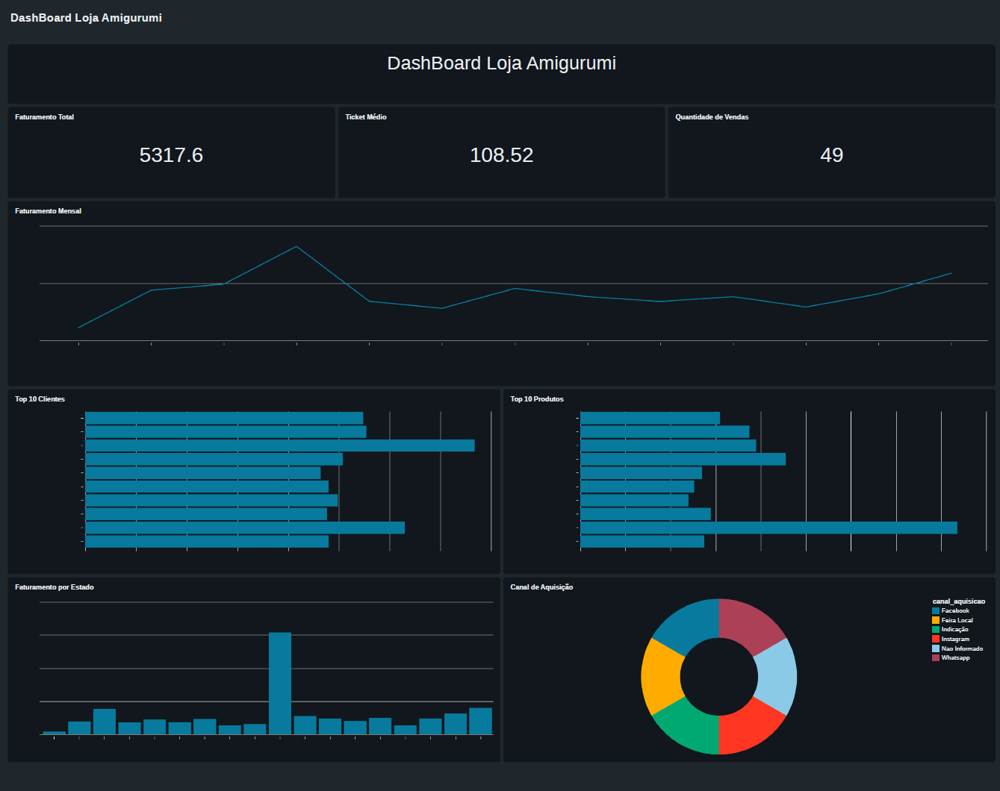

# 🧶 Projeto Dados Loja — Arquitetura Medallion no Databricks

Pipeline de dados completo implementado com **PySpark**, **Delta Lake** e **Unity Catalog** no Databricks, seguindo a arquitetura Medallion (Bronze → Silver → Gold), com tema em uma loja de amigurumi artesanal.

---

## 📌 Sobre o Projeto

Este projeto implementa um pipeline de engenharia de dados end-to-end utilizando a arquitetura Medallion, onde os dados passam por três camadas progressivas de qualidade — da ingestão bruta até agregações analíticas prontas para consumo em dashboards.

O cenário de negócio simula uma loja de amigurumi com três fontes de dados: **estoque de produtos**, **base de clientes** e **registro de vendas com despesas embutidas**.

---

## 🗂️ Estrutura do Repositório

```
Projeto_dados_Loja/
├── data/
│   ├── clientes.csv          # 25 clientes com dados de localização e canal de aquisição
│   ├── estoque.csv           # 25 produtos com custo de produção e preço de venda
│   └── vendas.csv            # 50 vendas com despesas, descontos e formas de pagamento
├── Bronze.ipynb              # Notebook — Ingestão bruta dos 3 CSVs
├── Silver.ipynb              # Notebook — Limpeza, padronização e validação
├── Gold.ipynb                # Notebook — Agregações analíticas e tabelas de BI
└── README.md
```

---

## 🛠️ Tecnologias Utilizadas

| Tecnologia | Uso |
|---|---|
| **Apache Spark / PySpark** | Processamento distribuído dos dados |
| **Delta Lake** | Armazenamento com transações ACID |
| **Databricks Unity Catalog** | Governança e organização das tabelas por camada |
| **Python** | Linguagem principal dos notebooks |
| **GitHub** | Versionamento com Conventional Commits |

---

## ⚙️ Como Executar

### Pré-requisitos

- Conta no [Databricks](https://databricks.com/) (Free Edition funciona)
- Unity Catalog com os catálogos `bronze`, `silver` e `gold` criados
- Volume criado para upload dos CSVs

### 1. Configure os dados

Faça upload dos CSVs da pasta `data/` para um Volume no Unity Catalog:

```
Catalog → Create Volume → data_projeto_loja
Faça upload de: clientes.csv, estoque.csv e vendas.csv
```

### 2. Ajuste os caminhos no notebook Bronze

```python
caminho_clientes = "/Volumes/workspace/default/data_projeto_loja/clientes.csv"
caminho_estoque  = "/Volumes/workspace/default/data_projeto_loja/estoque.csv"
caminho_vendas   = "/Volumes/workspace/default/data_projeto_loja/vendas.csv"
```

### 3. Execute os notebooks em sequência

```
Bronze → Silver → Gold
```

---

## 🟤 Camada Bronze — Ingestão Bruta

**Objetivo:** Ingerir os dados exatamente como estão, sem transformações, preservando registros corrompidos para auditoria.

**O que foi implementado:**

| Recurso | Descrição |
|---|---|
| Schema explícito (`StructType`) | Define os tipos de cada coluna para leitura segura |
| Modo `PERMISSIVE` | Registros inválidos ficam com campos nulos, não são descartados |
| `columnNameOfCorruptRecord` | Linhas malformadas são capturadas na coluna `corrupt_record` |
| `current_timestamp()` | Adiciona coluna `data_ingestao` em cada tabela |
| Escrita Delta | Grava as três tabelas brutas no catálogo `bronze.default` |

**Tabelas geradas:**

- `bronze.default.clientes_bronze`
- `bronze.default.estoque_bronze`
- `bronze.default.vendas_bronze`

---

## ⚪ Camada Silver — Limpeza e Padronização

**Objetivo:** Transformar dados brutos em dados confiáveis, com tipos corretos, datas padronizadas e registros classificados por validade.

**Tratamentos aplicados:**

| Tratamento | Descrição |
|---|---|
| `dropDuplicates()` | Remoção de duplicatas pela chave de negócio de cada tabela |
| Padronização de datas | `try_to_date` com múltiplos formatos (`yyyy-MM-dd`, `yyyy/MM/dd`, `dd/MM/yyyy`) |
| Limpeza de valores monetários | Remoção de `R$`, troca de vírgula por ponto, cast para `Decimal(10,2)` |
| Tratamento de inteiros nulos | `regexp_replace` + `cast("int")` com `coalesce` para substituir nulos por 0 |
| Criação de `ano_mes` | Colunas derivadas de datas para facilitar agrupamentos temporais |
| Validação de e-mail | Flag `email_valido` via `RLIKE` com regex padrão RFC |
| Padronização de `canal_aquisicao` | `initcap` + substituição de valores ausentes por `"Nao Informado"` |
| `registro_valido` | Flag booleana por tabela indicando se o registro tem todos os campos críticos |
| `registros_invalidos` | Tabela unificada de auditoria com registros problemáticos das 3 fontes |

**Tabelas geradas:**

- `silver.default.clientes_silver`
- `silver.default.estoque_silver`
- `silver.default.vendas_silver`
- `silver.default.registros_invalidos`

---

## 🟡 Camada Gold — Agregações Analíticas

**Objetivo:** Gerar dados prontos para consumo em dashboards e análises de negócio, cruzando informações das 3 tabelas Silver.

**Base analítica:** Um JOIN triplo entre `vendas + clientes + estoque` filtrando apenas `registro_valido = true`, a partir do qual todas as tabelas Gold são derivadas.

**Tabelas geradas:**

| Tabela | Descrição |
|---|---|
| `gold.default.faturamento_mensal_loja` | Faturamento, custo, margem e quantidade de vendas por mês |
| `gold.default.top_produtos_loja` | Ranking de produtos por faturamento com margem e custo real |
| `gold.default.top_clientes_loja` | Ranking de clientes por valor total gasto e ticket médio |
| `gold.default.top_canal_aquisicao_loja` | Faturamento e margem por canal de aquisição |
| `gold.default.faturamento_estado_loja` | Faturamento e volume de vendas por estado |
| `gold.default.kpi_loja` | KPIs gerais: faturamento total, quantidade de vendas e ticket médio |

---

## 🏗️ Arquitetura

```
CSVs Brutos (clientes / estoque / vendas)
           │
           ▼
┌──────────────────────────────────┐
│  BRONZE                          │
│  Ingestão sem transformação      │
│  bronze.default.*_bronze         │
└────────────────┬─────────────────┘
                 │
                 ▼
┌──────────────────────────────────┐
│  SILVER                          │
│  Limpeza, validação e flags      │
│  silver.default.*_silver         │
│  silver.default.registros_inv... │
└────────────────┬─────────────────┘
                 │
                 ▼
┌──────────────────────────────────┐
│  GOLD                            │
│  JOIN triplo + agregações de BI  │
│  gold.default.*_loja             │
└──────────────────────────────────┘
```

---

## 📊 Sujeiras Intencionais nos CSVs

Os arquivos de entrada foram propositalmente construídos com problemas reais para exercitar os tratamentos da Silver:

| Problema | Onde |
|---|---|
| Datas em 3 formatos diferentes | `vendas.csv` — `data_venda` e `data_despesa` |
| Data inválida (`2024-13-01`) | `vendas.csv` — mês 13 inexistente |
| E-mail malformado (sem `@`) | `clientes.csv` — C005 |
| E-mail incompleto | `clientes.csv` — C020 |
| Desconto negativo (`-1`) | `vendas.csv` — V045 |
| Preço ausente | `vendas.csv` — V045 |
| Produto sem categoria | `estoque.csv` — P020 |
| Quantidade nula | `estoque.csv` — P010 |
| Canal de aquisição ausente | `clientes.csv` — C020 |

---

## 📊 Dashboard — Visão Geral

Dashboard interativo construído no Databricks com as tabelas da camada Gold,
apresentando KPIs gerais, faturamento mensal, rankings de clientes e produtos,
distribuição geográfica e análise por canal de aquisição.



---

## 👤 Autor

**Paulo Victor Matias**
Bacharelado em Sistemas de Informação — Universidade Federal de Uberlândia (UFU)